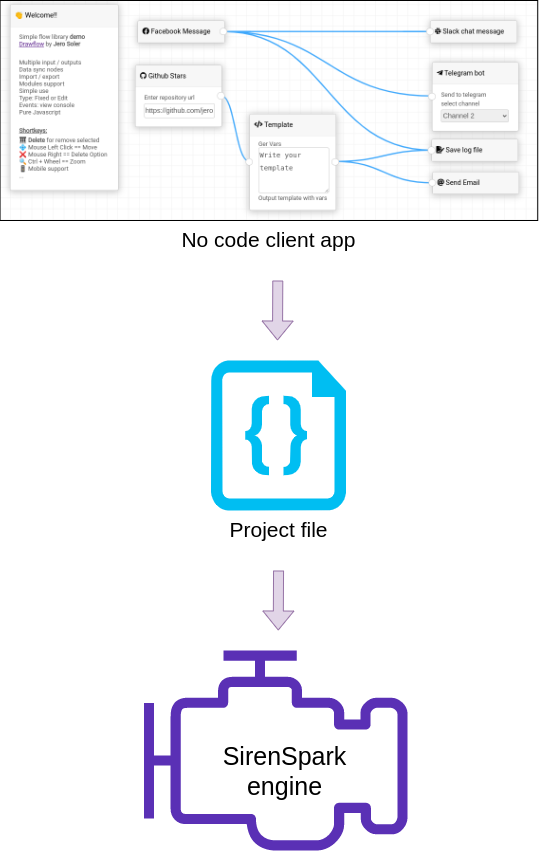

# SirenSpark

**SirenSpark** is an **open-source**, **free to use** ETL tool designed to handle **spatial data**.

It is powered by a **crowdfunding** business strategy that allows anyone to participate.

## Our goals
* **Open-source** and free to use
* Cross-platform compatibility for easy integration anywhere
* **No-code** tool with the ability to integrate your own Python-coded modules
* Capable of handling **spatial data**
* Provides **dynamic data visualization** throughout the entire process
* Can be executed via the **command line**

## How it works

SirenSpark is divided into two main parts: the **client** coded with Angular & Electron, and the **engine** which utilizes Spark and other libraries like GDAL or Sedona for data manipulations.

Using the **client**, users can create a project file (JSON) within a no-code environment. 
This file describes the graphical definition of the project as well as the engine's configuration, including reader/writer/transformer parameters and connections.

The project can then be **launched** from the **client** using the play button or via the **command line**.
The engine reads the project file and executes the defined steps.



## Crowdfunding business strategy

The SirenSpark team regularly adds new functionalities, formats, and transformations, and **everyone can participate!**

You can code it yourself and make a pull request or use the SirenSpark hub **wish list**.

In the SirenSpark hub (currently under development), you can create entries on the **wish list** and vote for other entries.

When adding an entry, the SirenSpark team provides an **estimate** and people can contribute to its development.

Similar to other crowdfunding projects, once the funding goal is reached, the functionality is developed and added to the source code.


## Usage

### Engine

#### Install

You will need python 3.8 installed with some dependencies

First install dependencies

Debian / Ubuntu :
```
sudo apt-get install default-jdk
sudo apt-get install libpq-dev
sudo apt-get install gdal-bin
```

Then install python requirements libs

```
pip install -r requirements.txt
```

#### Run a project

Go into the engine dir

`cd engine`

Run `main.py` with a project path as argument

`python main.py samples/xml2json/xml2json.json`